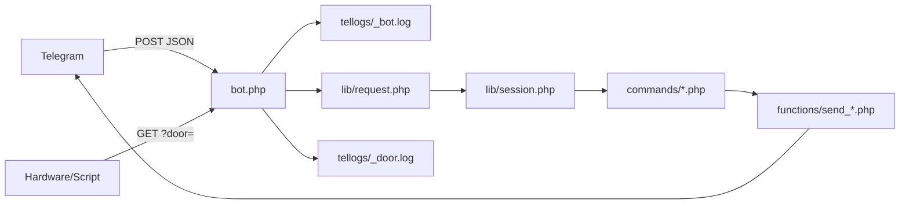

# AGENTS.md – 3WR TelBot

Leitfaden für KI-Assistenten und Entwickler, die an diesem Telegram-Bot arbeiten.

## Projektziel

PHP-Webhook-Bot für den Dreiwerkraum: Nachrichten von Telegram verarbeiten, Antworten per Bot-API senden, Türstatus und Freigaben über Dateien in `tellogs/` steuern.

## Architektur

- **Einstieg:** nur `bot.php` als Webhook-URL.
- **Konfiguration:** `config.php` – alle Secrets und Bot-Texte (`content.*`, URLs, Chat-IDs). Nicht in `commands/` duplizieren.
- **Kein Framework:** plain PHP, `require`/`include`, globale `$ctx` in Command-Dateien.
- **Neue Befehle:** neue Datei unter `commands/`, am Anfang auf `$ctx['command_arr'][0]` prüfen; wird automatisch über `lib/dispatch.php` geladen (außer `door_http.php`).

## Wichtige Konventionen

1. **Session-Flags** nicht duplizieren – immer `applySessionFlags()` in `lib/session.php` nutzen bzw. erweitern.
2. **Pfade zu Logs** immer über `logPath($config, 'dateiname')` aus `lib/session.php`, nicht hardcodierte `../../tellogs/`.
3. **Telegram senden** nur über Funktionen in `functions/` (`sendMessage`, `sendPolll`, …).
4. **Befehle normalisieren:** Kleinbuchstaben, `@dreiwerkraum_bot` wird in `lib/request.php` entfernt.
5. **Minimale Diffs:** Verhalten für Vereinsmitglieder beibehalten; Texte nur ändern, wenn explizit gewünscht.

## Dateien, die oft geändert werden

| Aufgabe | Ort |
|---------|-----|
| Neuer Slash-Befehl | `commands/neuer_befehl.php` |
| Chat-ID / Token / WLAN / Konto | `config.php` (inkl. `content[]`) |
| Freigabe-Logik | `commands/private_access.php`, `lib/session.php` |
| Umfrage-Logik | `commands/poll.php` |
| Termine | `commands/dates.php`, `functions/calender.php` |
| Tür per Telegram | `commands/door.php` |
| Tür per HTTP | `commands/door_http.php`, `lib/dispatch.php` |

## Bekannte Stolpersteine

- **`/ban`:** entfernt Zeilen aus `_privateApproved.log`; Logik vergleicht `intval($line)` mit Chat-ID – bei Format `name:id` wirkt das anders als bei Freigabe-Checks. Vor Änderungen Verhalten testen.
- **`dates.log`:** JSON-Format erwartet (`functions/calender.php`); alte Komma-Variante ist auskommentiert.
- **`bot.json`:** scheint separates Hardware-/Monitoring-JSON, nicht vom Bot-Webhook genutzt.
- **`functions/calender-safe.php`:** Backup/Variante – vor Löschen prüfen, ob noch referenziert.
- **Secrets:** `config.php` ist in `.gitignore`; `config.example.php` nur Platzhalter. Keine Tokens in Kommentaren (siehe früheres `send_poll.php`-Beispiel – entfernt).
- **Lizenz:** MIT – siehe `LICENSE`.
- **GitHub / Security:** Vor Publish `SECURITY.md` und README-Abschnitt „Veröffentlichen auf GitHub“ beachten; `config.php` nie committen.

## Tests (manuell)

Ohne automatisierte Tests im Repo:

1. `/start` in freigegebener Gruppe und in nicht freigegebenem Privatchat
2. `/freigabe` → Admin erhält Nachricht → `/allowPerson`
3. `/auf` und `/zu` → `_door.log` enthält `Status 1` / `Status 0`
4. `/poll 0-3` mit optionalen Uhrzeiten
5. `bot.php?door=<key>&set=Status%201` ohne Telegram-Body

## Offene Punkte (bei Unklarheit User fragen)

- Soll `/stunden` implementiert werden? (in `/start` erwähnt, Code fehlt)
- Sollen Bot-Token und `door_key` in Umgebungsvariablen ausgelagert werden?
- Ist `bot.json` / `calender-safe.php` noch produktiv nötig?

## Sprache

Bot-Antworten und Commit-/PR-Texte für Vereinsmitglieder: **Deutsch**. Code-Kommentare und diese Datei: Deutsch oder Englisch, konsistent pro Datei.
